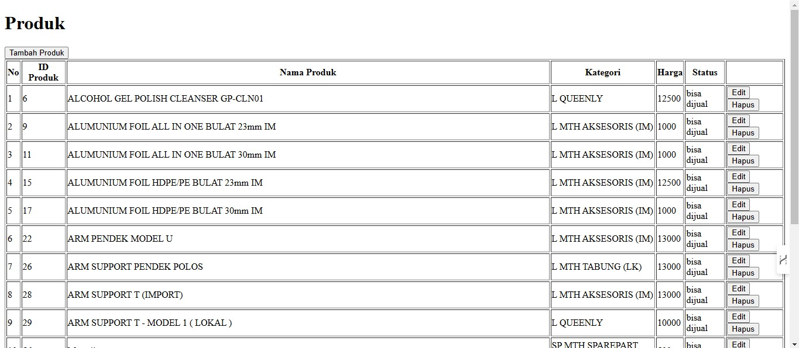
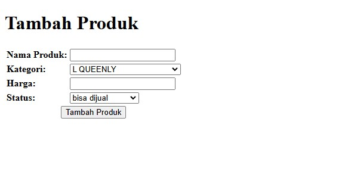
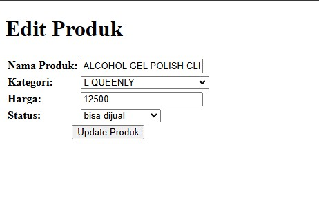

# Nama Proyek  
  
Repository Fast Print.  
  
## Daftar Isi  
  
- [Prasyarat](#prasyarat)  
- [Instalasi](#instalasi)  
- [Penggunaan](#penggunaan) 
- [File Database](#file-database) 
  
## Prasyarat  
  
Sebelum memulai, pastikan Anda telah menginstal:  
  
- [PHP](https://www.php.net/downloads) (versi 7.2 atau lebih baru)  
- [CodeIgniter](https://codeigniter.com/download) (versi terbaru)  
- [MySQL](https://www.mysql.com/downloads/) atau [MariaDB](https://mariadb.org/download/)  
- [Composer](https://getcomposer.org/download/) (jika diperlukan)  
  
## Instalasi  
  
1. **Clone repositori ini:**  
  
  git clone https://github.com/Rizanoer/fast-print.git

2. **Masuk ke direktori proyek:**  

  cd nama-proyek

3. **Instal dependensi:**

  composer install

4. **Konfigurasi database:**  

  - Salin file `application/config/database.php.example` menjadi `database.php` atau kalau sudah ada sesuaikan pengaturan database Anda (fastprint).

## Penggunaan  
  
1. **Jalankan server lokal:**  
  
  Jalankan XAMPP atau Laragon untuk mengakses server lokal

2. **Konfigurasi database:** 

  insert database di folder database/fastprint.sql
  - Jika pakai PhpMyAdmin langsung import saja, akan langsung terbentuk database dengan nama "fastprint"
  - Jika pakai HeidiSql, buka filenya dan copy semua lalu jalankan di query tab

3. **Akses aplikasi:**  
  Buka browser dan akses `http://localhost/folderclone`. contoh `http://localhost/fastprint`

4. **Fitur:**  
  - Tambah produk  
  - Edit produk  
  - Hapus produk  
  - Lihat daftar produk 

## File Database

Terdapat di folder database setara dengan folder application, nama databasenya fastprint.sql

## Tampilan

**Listing:**  
  

**Tambah:**  
  

**Edit:**  
  

